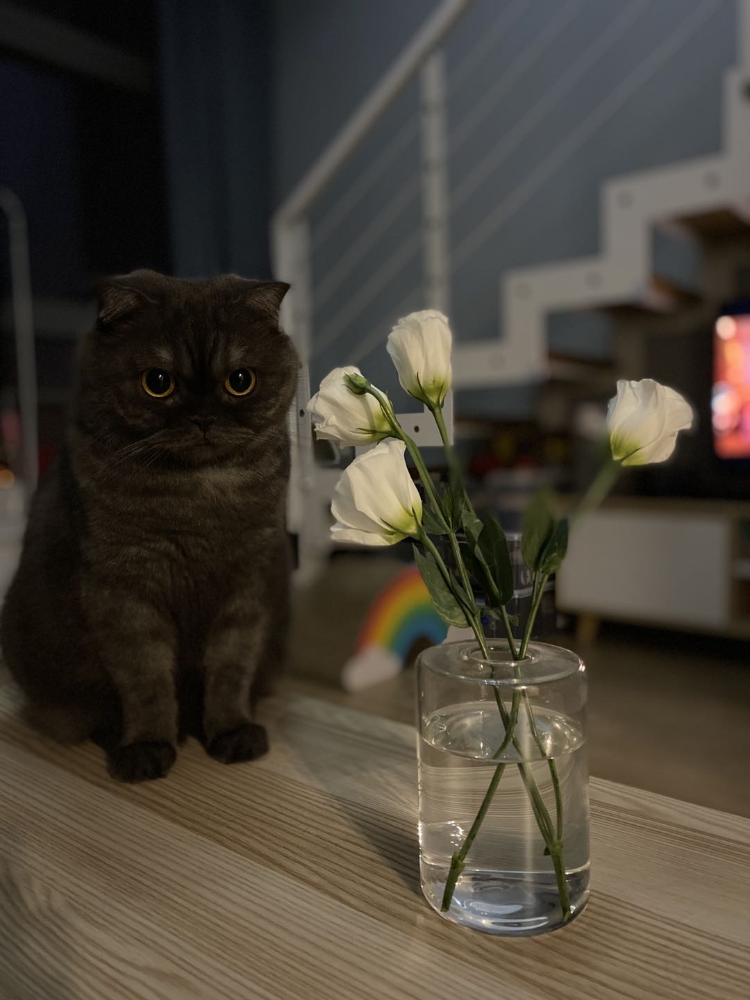

关于搭建 Blog，下面这篇文章已经介绍的比较详细了，但是我在按照他的步骤搭建过程中遇到了一些坑，这里记录一下，分享给大家。

> 参考：
[使用GitHub搭建自己的Blog](https://zander2014.github.io/blog/2020/07/05/使用GitHub搭建自己的Blog/)

# 搭建 Blog

这部分参考文章的步骤没什么区别，并且参考文章写的更加详细，建议根据参考文章搭建。
我把这部分加进来，主要是想测试一下图片的功能。

## 新建 Repository


## 填写 Repository name


## 设置 GitHub Pages


## 选择主题


## 提交代码


## 查看 Blog


# 同步代码

## 选择编辑器

这部分参考文章没有说明使用的是什么编辑器，我这边直接用的是 IntelliJ IDEA。

## 使用 IDEA 同步 GitHub 代码

这一步就不多说，应该都会的吧。

# 安装 NexT

⚠️ **警告！警告！前方大量踩坑，不愿意折腾的同学可以趁早放弃了。**
~~也可能是我环境的问题，希望你们在操作的时候一切顺利。~~

> 参考：[NexT 官方使用文档](http://theme-next.simpleyyt.com/getting-started.html#install-next-theme)

正常来说，安装 NexT 只需要几分钟就可以了，但是在这个过程中我遇到了很多坑，导致我搞了两个半天才搞定。
下面记录一下：

## 坑一

`安装依赖：bundle install` 这一步报下面这个错：

```
An error occurred while installing commonmarker (0.17.13), and Bundler cannot continue.
```

解决方法：
1. ~~重装 Homebrew，没有解决问题~~
2. ~~重装 Ruby，重装之后发现用 Homebrew 安装的 Ruby 版本（3.1.x）和 Mac 自带的 Ruby 版本（2.6.x）不一致，又改环境变量把 Ruby 改到 Homebrew 安装的那个版本，但也没有解决问题~~
3. 删除 Gemfile.lock 文件，重新执行 `bundle install` 命令，操作完成后换了一个错误：`An error occurred while installing unf_ext (0.0.8.2), and Bundler cannot continue.`
4. 执行 `xcode-select --install` 命令，安装 xcode-select 后，再执行 `bundle install` 命令，执行成功 🎉🎉🎉

## 坑二 

`运行 Jekyll：bundle exec jekyll server` 这一步报下面这个错：

```
bundler: failed to load command: jekyll (/usr/local/bin/jekyll)
```

解决方法：
1. 执行 `jekyll --version` 命令查看 jekyll 版本号，返回 `zsh: command not found: jekyll`
2. 执行 `bundle info jekyll` 命令，返回 jekyll 版本号 `* jekyll (3.9.2)`
3. 折腾到这里，有点晕乎乎的了，记不太清楚后面做了什么操作
4. 根据这位大佬的方法，执行了 `bundle add webrick`，再运行 Jekyll，终于成功了 🎉🎉🎉

https://talk.jekyllrb.com/t/load-error-cannot-load-such-file-webrick/5417/5
   
主要就以上两个大坑，解决问题的过程中还遇到了无数小坑，精力有限，没有深追这些问题的原因，而且是隔了一天再记录的，很多细节已经忘记了，希望这些模糊的记忆对大家又帮助。

# Blog 主题配置

> NexT 官方文档已经又详细的说明了，这里就不多说了：
[主题配置](http://theme-next.simpleyyt.com/theme-settings.html)

# 写博客

用手（其他部位也可以）写。

写的过程中，发现了一个误以为是 BUG 的功能。
如果文件开头的 **date** 属性中填的时间大于服务器时间，那么这篇文章是不会在 Blog 中显示的，猜测应该是 NexT 设计的一个定时发布文章的功能👍。


# 最后

附上两张可爱猫猫照🐱



